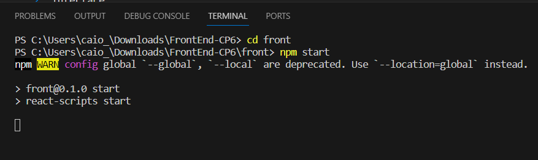

# Conteúdo criado nas aulas de OPTIMIZATION-TECHNOLOGY(FrontEnd) + DIGITAL EXPERIENCE PLATAFORM(BackEnd)

### Backend

- Link da Api
  - https://github.com/CaioZanardo/BackEnd-Api-CP6 

### FrontEnd

- Desenvolvido em React para criar o frontend da aplicação, que interage com o backend para exibir informações na interface.

- Como utilizar
  - Executar o comando "cd front" para mudar o diretório;
  - Executar o comando "npm start" para subir o Frontend;

-  Após o comando a cima abrir uma página no browser com o conteúdo. Caso não abrir, acessar este endpoint "http://localhost:3000/" no browser.

## Grupo

- André Spinelli Cintra RM 551016
- Augusto de Oliveira Laurino RM 93498
- Caio Felipe Britto Zanardo da Silva RM 95125
- Gabriel Wilke Azevedo RM 95211
- Guilherme de Lucas Garcia RM 94392